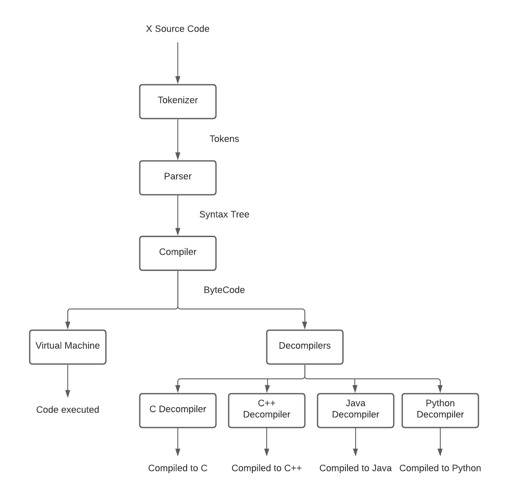

# X Programming Language

X is a placeholder language with a python and JS like syntax and a shareable bytecode IR that can be translated into any other programming language.

## Languages Supported

1. **C**
2. **C++**
3. **Java**
4. **Python**

What does this list mean? This means that you can compile your X code into any one of these programming languages 😲😲😲😲!

## Pipeline

<div align="center">
    
<div>

## Steps to run

1. Write a script in X and save it with .x extension.

2. To run the script:

```bash
user@programmer~:$ x -i <filename>.x
```

3. To compile to C:

```bash
user@programmer~:$ x -i <filename.x> --decompile-c
```

4. To compile to C++:

```bash
user@programmer~:$ x -i <filename.x> --decompile-cpp
```

5. To compile to Java:

```bash
user@programmer~:$ x -i <filename.x> --decompile-java
```

6. To compile to Python:

```bash
user@programmer~:$ x -i <filename.x> --decompile-py
```